# Informe de Laboratorio 4.2: Implementación de Infraestructura de Red y Servicios

**Universidad Mayor, Real y Pontificia de San Francisco Xavier de Chuquisaca** **Facultad de Tecnología** **Carrera:** Ingeniería de Sistemas

---

**Asignatura:** Infraestructura, Plataformas Tecnológicas y Redes (SIS313)  
**Docente:** Ing. Marcelo Quispe Ortega  
**Semestre:** 1/2026  

---

### 👥 Integrantes del Grupo
* **Jurado Mamani Melany Shelen**
* **Quispe Gardeazabal Fernando Jose**

---

## 1. Introducción

En el ámbito de la administración de servidores y redes, la disponibilidad y la eficiencia en la entrega de contenidos son pilares fundamentales. Para lograr estos objetivos, se emplean conceptos críticos que han sido aplicados en la arquitectura de este laboratorio:

### 1.1. Proxy Inverso
Un **Proxy Inverso** es un servidor que se sitúa frente a los servidores web y actúa como intermediario para las peticiones de los clientes. A diferencia de un proxy tradicional (que protege al cliente), el proxy inverso protege y optimiza al servidor. Sus funciones principales incluyen:
* **Seguridad:** Oculta la identidad y estructura de la red interna de servidores.
* **Cifrado SSL:** Aligera la carga de los servidores finales gestionando los certificados de seguridad.
* **Compresión y Caché:** Acelera la entrega de contenido estático.

### 1.2. Balance de Carga (Load Balancing)
El **Balance de Carga** es la técnica de distribuir el tráfico de red entrante entre varios servidores para asegurar que ningún servidor soporte una carga excesiva. Esto garantiza:
* **Alta Disponibilidad:** Si un servidor falla, el tráfico se redirige automáticamente a los demás.
* **Escalabilidad:** Permite añadir más servidores conforme crece la demanda de usuarios.
* **Optimización de Recursos:** Maximiza el rendimiento de la infraestructura existente.

### 1.3. Servidor DNS (Domain Name System)
El **DNS** es el servicio encargado de traducir nombres de dominio legibles por humanos (como `www.lab42.local`) en direcciones IP numéricas que los equipos utilizan para comunicarse. En este laboratorio se implementa un servidor DNS autoritativo usando **BIND9**, que gestiona una zona local propia con registros SOA, NS, A y CNAME.

### 1.4. Servidor Web con Nginx
**Nginx** es un servidor web de alto rendimiento utilizado para servir contenido estático y actuar como proxy inverso. En este laboratorio se configura mediante **Virtual Hosts**, permitiendo que un mismo servidor responda a peticiones del dominio `lab42.local` de forma organizada y eficiente.

### 1.5. Integración DNS + Web
La integración entre el servidor DNS y el servidor Web permite que los clientes de la red accedan al contenido por nombre de dominio en lugar de por dirección IP, simulando el funcionamiento de una infraestructura real de producción. En este laboratorio, estos conceptos se aplican tanto en una práctica individual (red virtualizada aislada) como en una práctica grupal (red física del aula en modo Puente).

En este laboratorio, estos conceptos se simulan mediante el direccionamiento de tráfico desde el Gateway (VM DNS) hacia el servidor Web, estableciendo las bases para una arquitectura escalable.

---

## 2. Metodología

Para el despliegue de la infraestructura, se siguió una metodología de configuración modular dividida en etapas de red, servicios de resolución y servicios de aplicación.

### 2.1. Preparación del Entorno
Se utilizaron 3 Máquinas Virtuales con **Ubuntu Server 24.04 LTS** en el hipervisor **VirtualBox**.
* **Red Interna:** Segmento `192.168.10.0/29` (Nombre: `Red_Lab4_2`).
* **Interfaces:** Configuración de modo NAT para salida a internet y adaptadores de red interna para comunicación inter-VM.

---

## 3. Sección 1: Preparación del Entorno Virtual (Práctica Individual)

El entorno de laboratorio se ha desarrollado en una sola estación de trabajo utilizando tres Máquinas Virtuales (VMs) con el sistema operativo **Ubuntu Server 24.04 LTS**. Esta infraestructura permite simular una red interna aislada con resolución de nombres propios y acceso controlado a Internet.

### 3.1. Arquitectura de Red y Asignación de IPs

Se ha configurado un esquema de direccionamiento estático bajo el segmento de red interna `192.168.10.0/29`. La VM **Lab4.2-DNS** ejerce la función de Gateway (Puerta de Enlace) para centralizar el tráfico y la resolución de nombres.

| VM | Hostname | Rol | Interfaces y Conexión | IP Interna (/29) |
| :--- | :--- | :--- | :--- | :--- |
| **Lab4.2-DNS** | `dns` | Servidor DNS (BIND9) | NAT (Internet) + Red Interna | `192.168.10.2` |
| **Lab4.2-Web** | `web` | Servidor Web (Nginx) | Red Interna | `192.168.10.3` |
| **Lab4.2-Client**| `client`| Cliente de Pruebas | Red Interna | `192.168.10.4` |

---

### 3.2. Configuración de Red en VirtualBox

Para garantizar el aislamiento y la comunicación inter-VM, se configuró la red interna denominada `Red_Lab4_2` en el hipervisor VirtualBox.

#### A. Configuración de la Red Interna
Se procedió a crear la infraestructura lógica de red necesaria para el laboratorio.

> 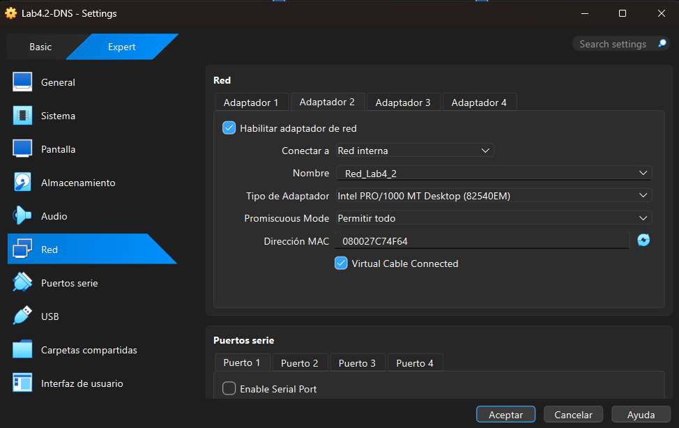

#### B. Configuración de Adaptadores en las VMs
Se asignaron los adaptadores correspondientes a cada máquina para cumplir con su rol en la topología:
* **VM DNS:** Adaptador 1 en modo NAT y Adaptador 2 en modo Red Interna.
* **VM Web y Cliente:** Adaptador 1 en modo Red Interna.

> 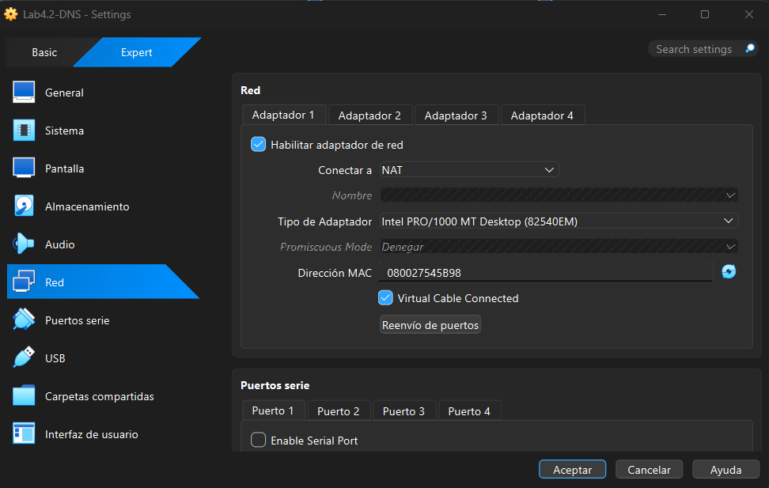
> 

---

### 3.3. Reenvío de Puertos (Port Forwarding) en VM Lab4.2-DNS

Para permitir la administración desde el host físico y el acceso a los servicios internos, se configuraron reglas de redirección en la interfaz NAT de la VM DNS.

| Nombre | Protocolo | Host IP | Puerto Host | IP Invitado | Puerto Invitado | Propósito |
| :--- | :--- | :--- | :--- | :--- | :--- | :--- |
| **SSH** | TCP | `127.0.0.1` | `2222` | `10.0.2.15` | `22` | Acceso Remoto |
| **DNS** | TCP/UDP | `127.0.0.1` | `5353` | `10.0.2.15` | `53` | Consultas DNS |
| **WEB** | TCP | `127.0.0.1` | `8080` | `192.168.10.3` | `80` | Acceso Web (Nginx) |

> 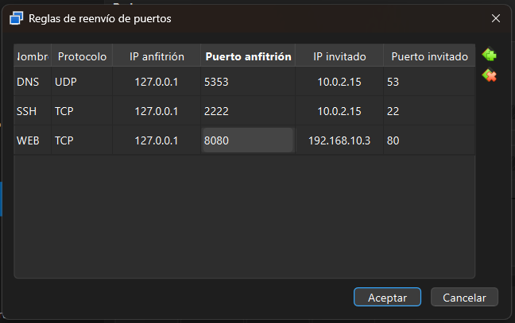

---

### 3.4. Configuración del Host Anfitrión (Archivo hosts)

Para que el dominio `www.lab42.local` sea accesible desde el navegador de la PC física, se editó el archivo `hosts` del sistema operativo apuntando el nombre de dominio a la dirección de bucle local.

> 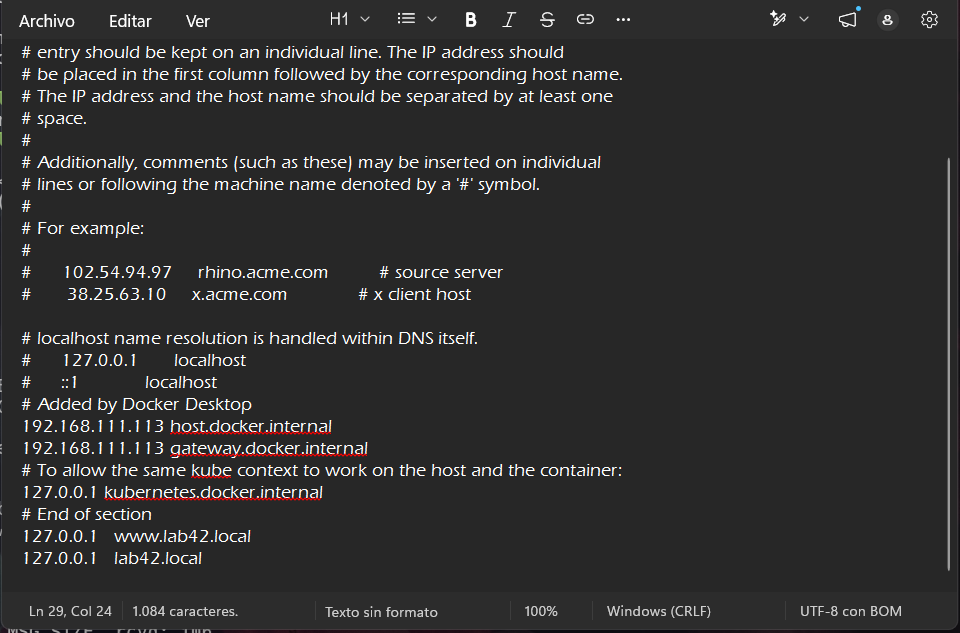

---

## 4. Sección 2: Práctica Guiada (Ejercicios Individuales)

Esta sección detalla la configuración lógica de las interfaces y la habilitación de las capacidades de enrutamiento del servidor DNS para consolidar la arquitectura de red interna.

### 4.1. Ejercicio 1: Configuración de Red Estática (Netplan)

Se utilizó la utilidad **Netplan** para definir el direccionamiento estático. Esta configuración es vital para asegurar que los servicios de DNS y Web siempre sean localizables en las mismas direcciones IP.

#### A. Configuración en la VM Lab4.2-DNS
El servidor DNS actúa como el nodo central. Se configuró la interfaz `enp0s3` con DHCP para el acceso a Internet y la `enp0s8` con la IP estática `.2` para la red interna.

* **Comando:** `sudo nano /etc/netplan/50-cloud-init.yaml` (Para editar el archivo de configuración).
* **Comando:** `sudo netplan apply` (Para aplicar y activar los cambios de red).

> 
> 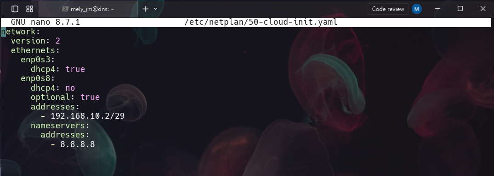
> 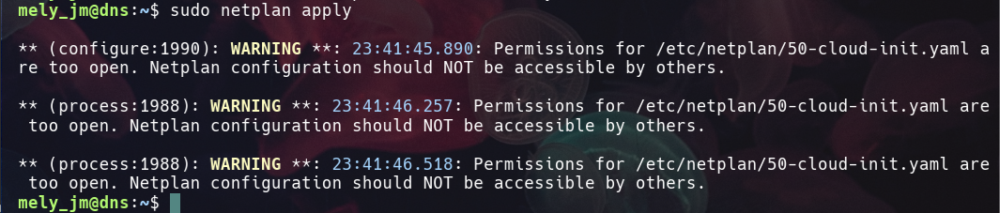
> 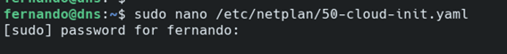
> 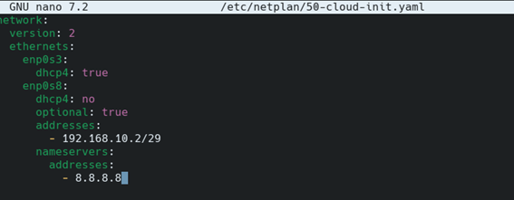

#### B. Configuración en la VM Lab4.2-Web
Se configuró la IP estática `.3`. Un punto crítico aquí fue definir la **ruta por defecto (default route)** apuntando a la IP de la VM DNS (`192.168.10.2`), permitiendo que el servidor web pueda responder peticiones fuera de su segmento.

> 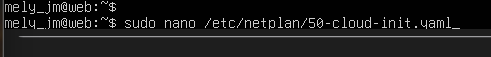
> 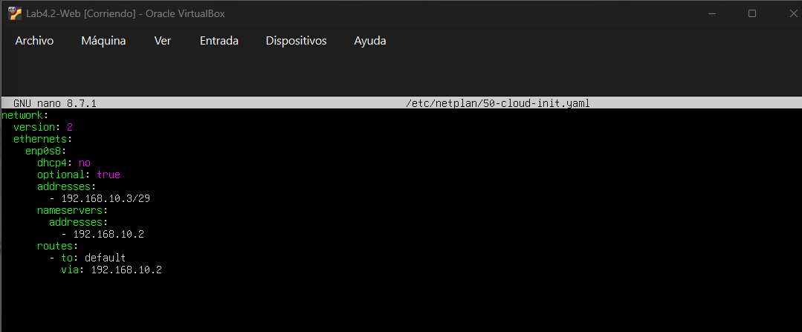
> 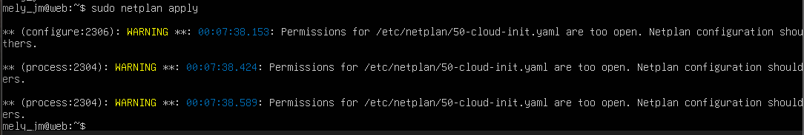
> 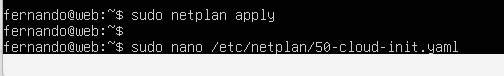
> 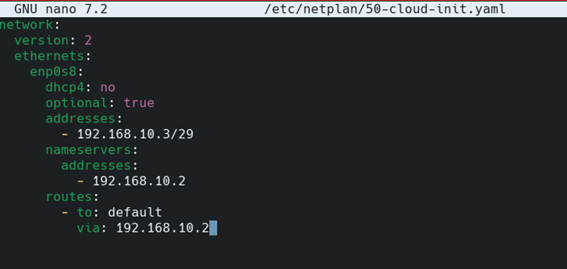

#### C. Configuración en la VM Lab4.2-Client
Se asignó la IP `.4`. Al igual que en la VM Web, el servidor DNS se configuró como el "Gateway" y el "Nameserver" principal para que el cliente pueda navegar y resolver dominios.

> 
> 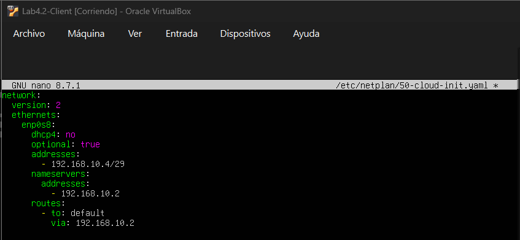
> 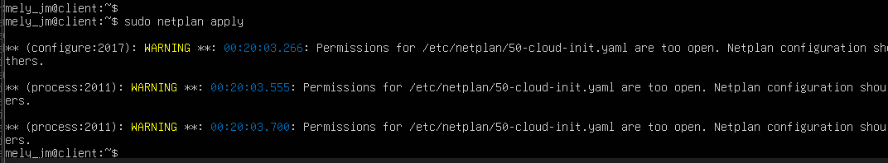
> 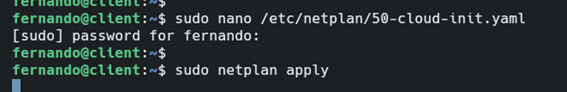
> 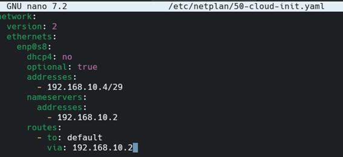

---

### 4.2. Habilitación de Reenvío de Paquetes y NAT (VM DNS)

Para que la VM DNS funcione como un **Gateway (Puerta de Enlace)**, debe ser capaz de mover paquetes entre sus dos interfaces (NAT e Interna).

#### A. Activación del IP Forwarding
Por defecto, Linux bloquea el paso de paquetes entre interfaces por seguridad. Se habilitó esta función modificando el parámetro del Kernel.

* **Comando:** `sudo nano /etc/sysctl.conf` (Para descomentar la línea `net.ipv4.ip_forward=1`).
* **Comando:** `sudo sysctl -p` (Para cargar los cambios del archivo de configuración inmediatamente sin reiniciar).

> 
> 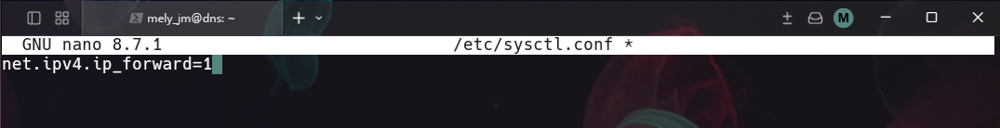
> 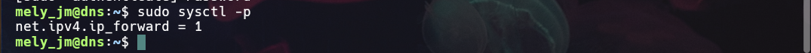
> 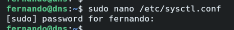
> 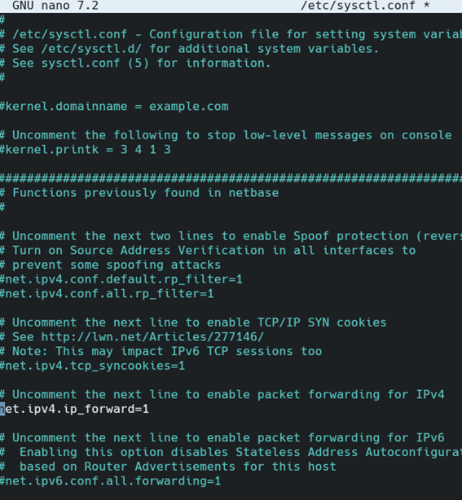
> 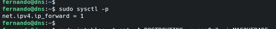

#### B. Configuración de Reglas de IPTables (NAT)
Se aplicó una regla de **Enmascaramiento (MASQUERADE)**. Esto permite que las máquinas internas (Web y Client) "salgan" a Internet usando la IP pública de la VM DNS.

* **Comando:** `sudo iptables -t nat -A POSTROUTING -o enp0s3 -j MASQUERADE`
    * `-t nat`: Indica que trabajamos en la tabla de traducción de direcciones.
    * `-A POSTROUTING`: Aplica la regla justo antes de que el paquete salga de la máquina.
    * `-o enp0s3`: Especifica la interfaz de salida hacia Internet.
    * `-j MASQUERADE`: Traduce las IPs internas a la IP de la interfaz de salida.

> 
> 
#### C. Persistencia de la Configuración
Las reglas de `iptables` se borran al reiniciar. Para evitar esto, se instaló un servicio que las carga automáticamente al arrancar el sistema.

* **Comando:** `sudo apt install iptables-persistent` (Instala el demonio de persistencia).
* **Comando:** `sudo netfilter-persistent save` (Guarda las reglas actuales en archivos que el sistema leerá al iniciar).

> 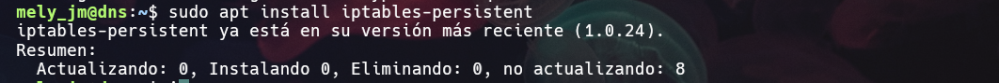
> 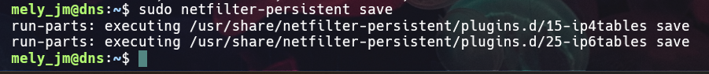
> 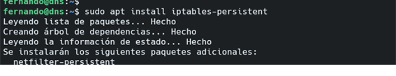
> 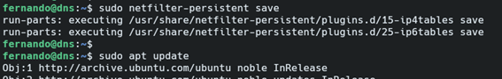
---

## 5. Ejercicio 2: Instalación y Configuración de BIND9 (VM Lab4.2-DNS)

En esta etapa se implementa el servidor DNS autoritativo para la red local. Esto permite que los nodos de la red se comuniquen mediante nombres de dominio (`FQDN`) en lugar de direcciones IP numéricas.

### 5.1. Instalación del Servicio
Se procedió a la instalación del paquete **BIND9**, junto con utilidades de diagnóstico y documentación oficial.

* **Comando:** `sudo apt update && sudo apt install bind9 bind9utils bind9-doc -y`
    * `bind9`: El demonio principal del servidor DNS.
    * `bind9utils`: Herramientas de verificación como `named-checkconf`.

> 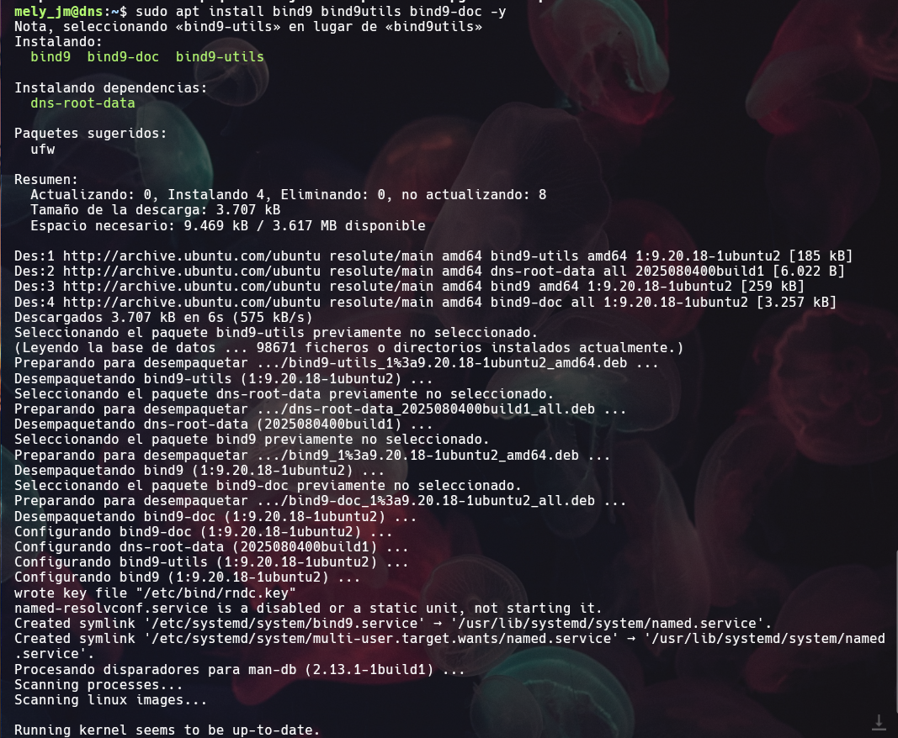
> 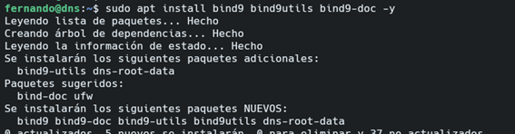
---

### 5.2. Definición de la Zona Maestra
Se configuró el archivo `named.conf.local` para informar al servidor que es la autoridad principal (**Master**) para el dominio `lab42.local`.

* **Archivo editado:** `sudo nano /etc/bind/named.conf.local`

> 
> 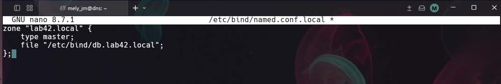
> 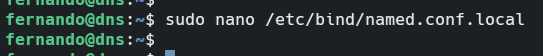
> 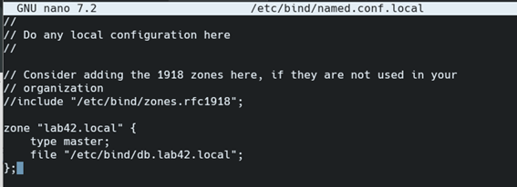

---

### 5.3. Creación y Configuración del Archivo de Zona
Se creó el archivo de base de datos de la zona a partir de una plantilla. Este archivo contiene los registros que traducen nombres a IPs.

* **Archivo editado:** `sudo nano /etc/bind/db.lab42.local`

**Explicación de registros clave utilizados:**
* **SOA (Start of Authority):** Define los parámetros globales de la zona y el correo del administrador.
* **NS (Name Server):** Identifica a `dns.lab42.local` como el servidor oficial de la zona.
* **A (Address):** Registro principal que vincula `dns` con la IP `.2` y `www` con la IP `.3` (VM Web).
* **CNAME (Canonical Name):** Crea un alias (`web`) que apunta al nombre real (`www`).

> 
> 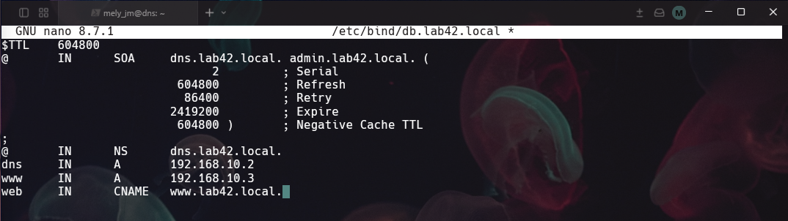
> 
> 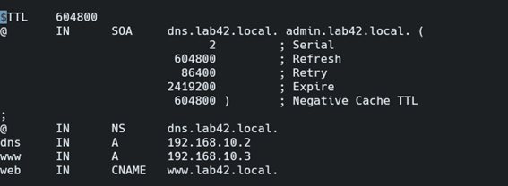
---

### 5.4. Verificación de Sintaxis y Estado del Servicio
Antes de activar la configuración, se utilizaron herramientas de validación para asegurar que no existan errores de escritura en los archivos.

* **Comando:** `sudo named-checkconf` (Verifica archivos de configuración global).
* **Comando:** `sudo named-checkzone lab42.local /etc/bind/db.lab42.local` (Verifica la integridad de la zona).

> 
> 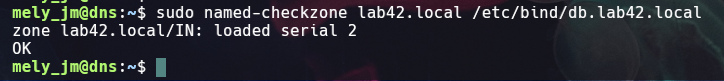
> 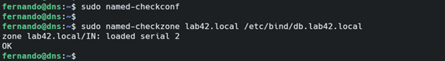

**Reinicio y comprobación de puertos:**
Para aplicar los cambios, se reinició el demonio y se verificó que el servidor esté escuchando peticiones en el puerto estándar **53**.

* **Comando:** `sudo systemctl restart bind9`
* **Comando:** `sudo netstat -tulnp | grep named`

> 
> 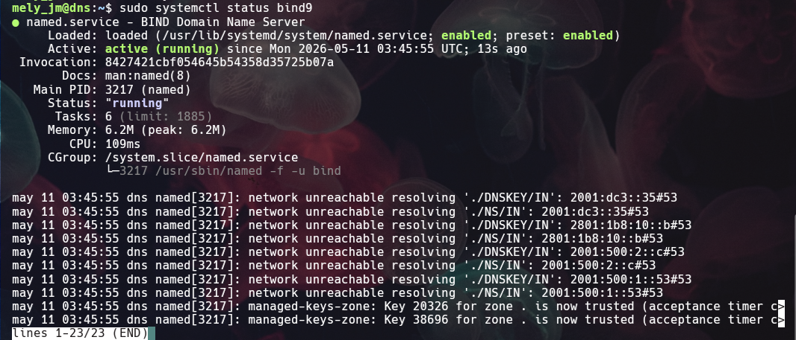
> 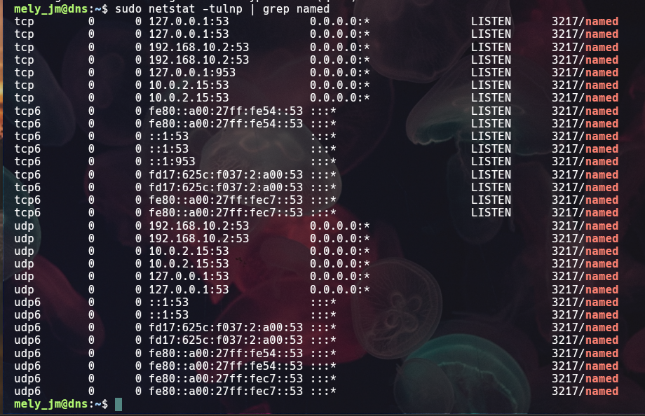
> 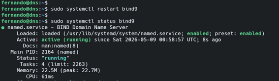
> 

---

## 6. Ejercicio 3: Configuración del Servidor Web (VM Lab4.2-Web)

En esta fase se realiza el despliegue del servidor de aplicaciones utilizando **Nginx**. Se configura un sitio virtual (Virtual Host) vinculado específicamente al nombre de dominio gestionado por el servidor DNS.

### 6.1. Instalación de Nginx
Se instaló el servidor web y se habilitó para que el servicio se inicie automáticamente con el sistema.

* **Comando:** `sudo apt update && sudo apt install nginx -y`
* **Comando:** `sudo systemctl enable --now nginx` (Habilita e inicia el servicio en un solo paso).

> 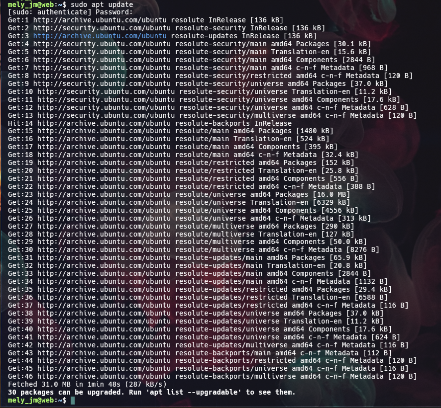
> 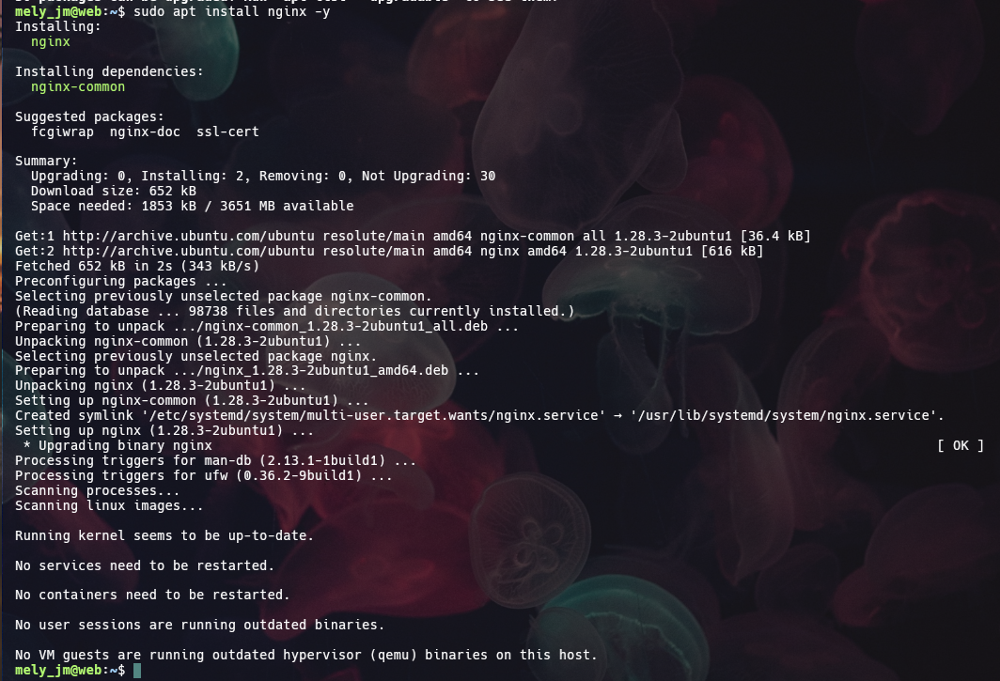
> 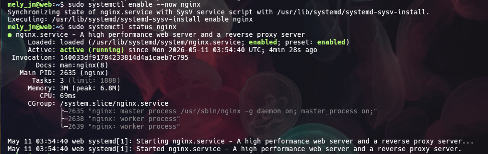
> 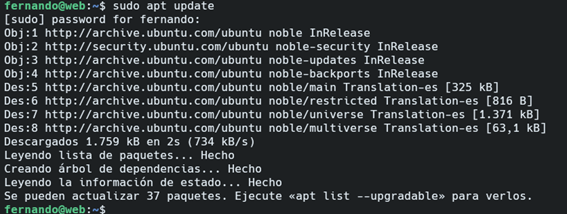
> 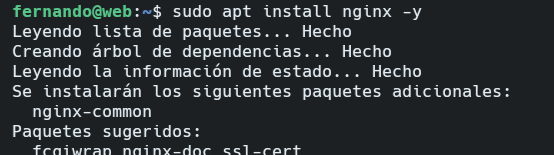
> 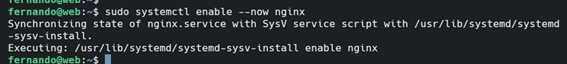

---

### 6.2. Configuración del Virtual Host
Para que el servidor responda correctamente a las peticiones del dominio `www.lab42.local`, se creó un archivo de configuración específico en el directorio `sites-available`.

* **Archivo editado:** `sudo nano /etc/nginx/sites-available/lab42.local`
* **Parámetros clave:**
    * `listen 80`: Escucha peticiones en el puerto estándar HTTP.
    * `server_name`: Define los dominios que este bloque atenderá.
    * `root`: Especifica la ruta física donde se alojan los archivos del sitio.

> 
> 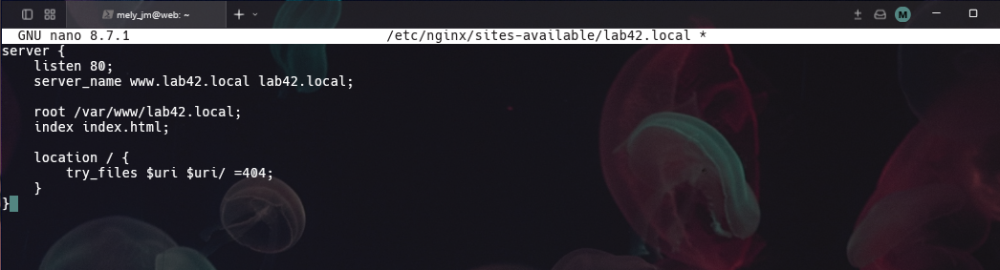
> 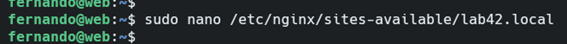
> 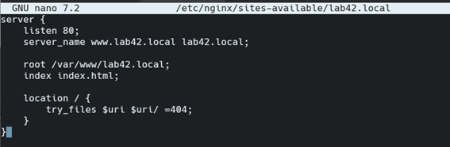

---

### 6.3. Activación del Sitio y Despliegue de Contenido
Se procedió a crear la estructura de directorios y a vincular la configuración para activar el sitio, eliminando la página por defecto de Nginx para evitar conflictos.

* **Enlace Simbólico:** `sudo ln -s /etc/nginx/sites-available/lab42.local /etc/nginx/sites-enabled/` (Activa el sitio sin mover archivos).
* **Limpieza:** `sudo rm /etc/nginx/sites-enabled/default` (Desactiva el sitio de bienvenida estándar).

> 
> 
> 
> 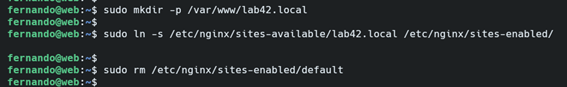

**Creación del index.html:**
Se generó una página de prueba personalizada mediante comandos de redirección de texto.

> 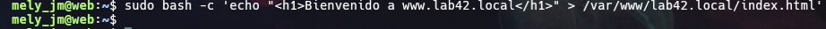
> 
> 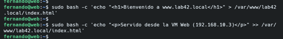

---

### 6.4. Verificación de Sintaxis y Reinicio
Antes de aplicar cambios en producción, se validó que no existieran errores en la estructura de la configuración de Nginx.

* **Comando:** `sudo nginx -t` (Test de configuración).
* **Comando:** `sudo systemctl restart nginx` (Aplica los cambios).

> 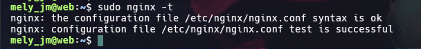
> 
> 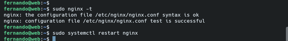

---

## 7. Ejercicio 4: Pruebas de Resolución y Acceso (Validación Final)

En esta etapa se realizan las pruebas de conectividad y resolución de nombres para verificar la correcta integración de todos los servicios configurados.

### 7.1. Validación desde la VM Cliente
Se utilizó el nodo cliente para validar que el servidor DNS interno responde correctamente a las consultas y que el servidor Web entrega el contenido solicitado a través del nombre de dominio.

#### A. Resolución de Registro A y CNAME
Se utilizaron las herramientas `dig` y `nslookup` para confirmar que el servidor DNS (`.2`) traduce correctamente el nombre a la IP del servidor Web (`.3`).

* **Prueba de Registro A:** `dig @192.168.10.2 www.lab42.local`
* **Prueba de Alias (CNAME):** `dig @192.168.10.2 web.lab42.local`

> 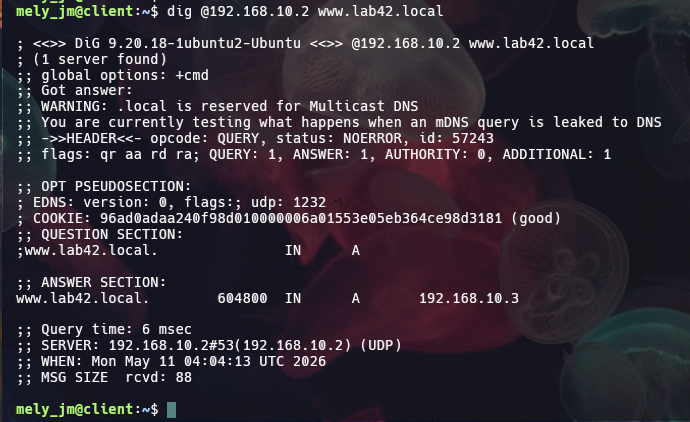
> 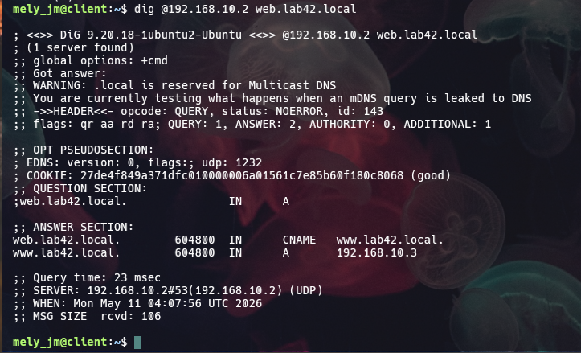
> 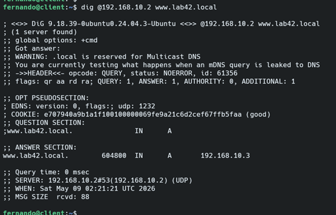
> 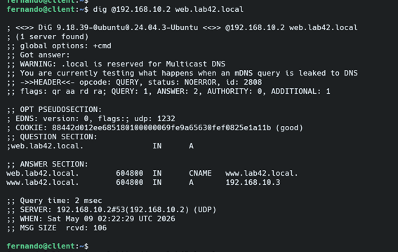
 
#### B. Acceso HTTP vía Dominio
Se ejecutó una petición mediante `curl` para verificar que el servidor Nginx sirve la página personalizada a través de la red interna.

* **Comando:** `curl http://www.lab42.local`

> 
> 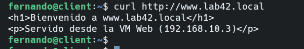
---

### 7.2. Validación desde la PC Anfitriona (Acceso Externo)
Para simular el acceso de un usuario externo a la organización, se configuró la PC física para interactuar con la infraestructura virtualizada.

#### A. Configuración de Resolución Estática en Windows
Se editó el archivo `hosts` del sistema anfitrión para vincular el dominio `www.lab42.local` con el bucle local (`127.0.0.1`), permitiendo que el navegador reconozca el nombre de dominio personalizado.

* **Ruta Windows:** `C:\Windows\System32\drivers\etc\hosts`

> 
> 

#### B. Acceso vía Navegador Web
Finalmente, se accedió a la dirección `http://www.lab42.local:8888`. Gracias al **Reenvío de Puertos** configurado en VirtualBox, el tráfico fue dirigido desde el puerto anfitrión `8888` al puerto `80` de la VM Web interna.

> 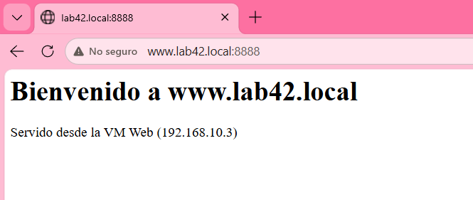
> 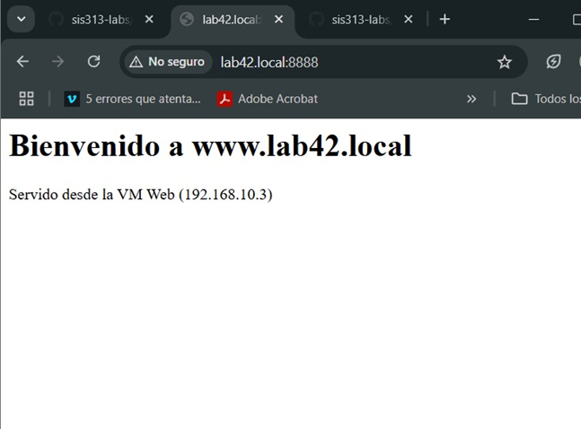
---

## 8. Sección 3: PRACTICA EN GRUPO

Esta fase tiene como objetivo la interconexión de servicios entre dos estaciones de trabajo físicas independientes dentro de la red del laboratorio. Se busca establecer una infraestructura DNS y Web distribuida que permita la resolución de nombres y el acceso al contenido desde ambas computadoras anfitrionas.

### 8.1. Roles y Asignación por Grupo

Para el despliegue funcional, se han dividido las responsabilidades de configuración de la siguiente manera, asegurando que cada nodo sea visible en la red física.

| Integrante | Rol Principal | VM a Configurar | Requisitos de Red |
| :--- | :--- | :--- | :--- |
| **Integrante 1** | Servidor DNS (BIND9) | VM Lab4.2-DNS | Adaptador en modo **Puente (Bridge)** |
| **Integrante 2** | Servidor Web (Nginx) | VM Lab4.2-Web | Adaptador en modo **Puente (Bridge)** |

> **Nota Técnica:** La selección del modo **Puente (Bridge)** en VirtualBox es fundamental para esta práctica. A diferencia del modo NAT, este permite que la interfaz virtual de la VM obtenga una dirección IP directamente de la infraestructura física del aula. Esto otorga una identidad propia a cada servidor dentro de la LAN, permitiendo que las consultas DNS y las peticiones HTTP crucen entre las PC físicas de los estudiantes.

> 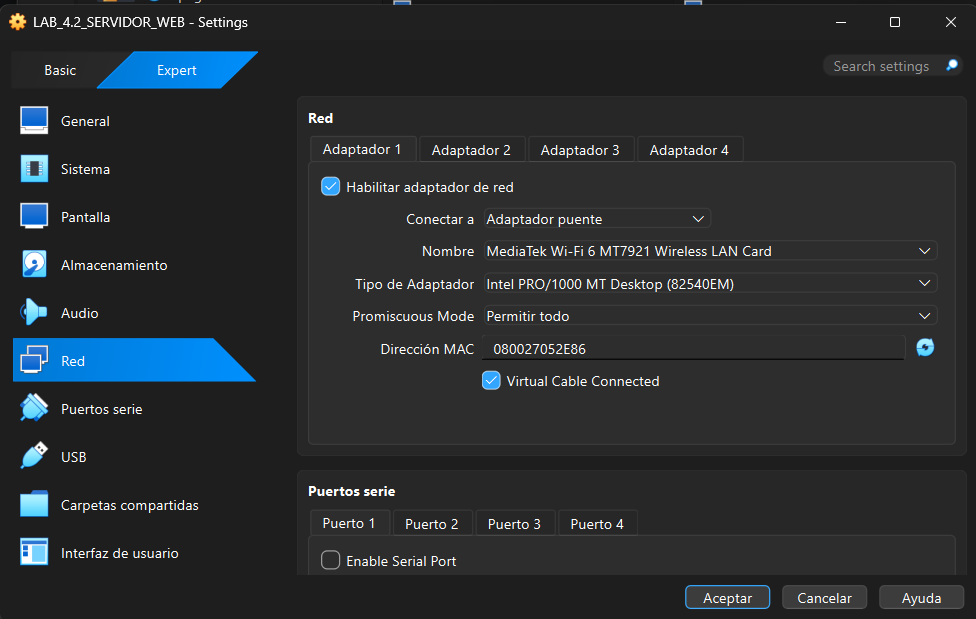
> 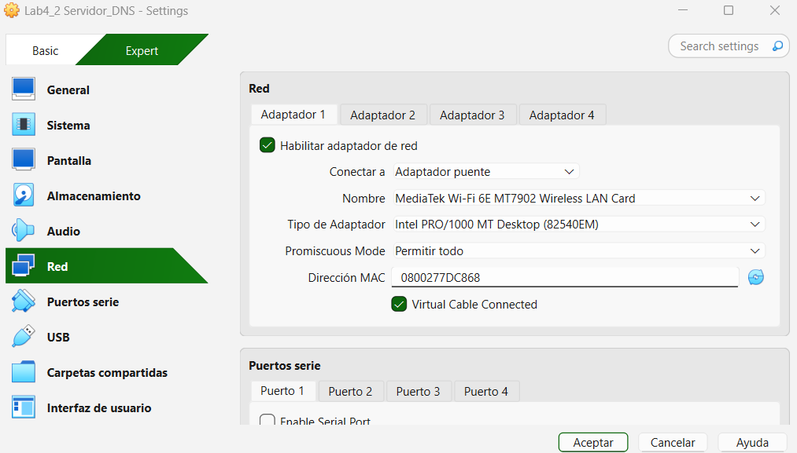
---

### 8.2. Dominio Local del Grupo

Se ha definido un dominio exclusivo para el grupo con el fin de evitar colisiones con otras infraestructuras dentro del aula. Este dominio es la base para la resolución de nombres que gestionará el servidor BIND9.

* **Dominio Elegido:** `mely-fer.local`
* **TLD:** `.local`

**Restricción de Unicidad:** Para cumplir con los requerimientos del docente, el dominio elegido ha sido validado como único. Esto asegura que no existan duplicados en las tablas de búsqueda de otros grupos, permitiendo una navegación limpia y sin conflictos de red entre los equipos de trabajo.

> 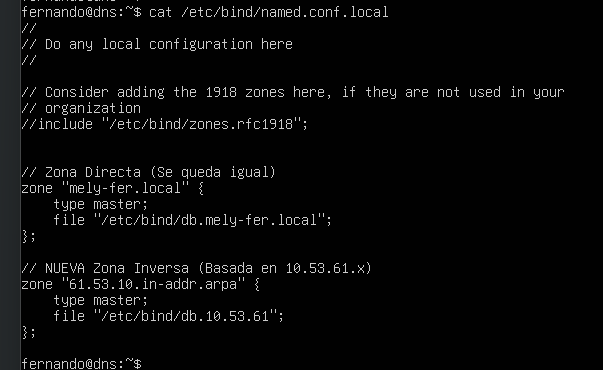

### 8.3. Tareas del Integrante 1 (Servidor DNS)

El Integrante 1 asumió la responsabilidad de gestionar la resolución de nombres para todo el grupo, operando bajo el modo Puente para servir como servidor autoritativo dentro de la red física del aula.

#### A. Configuración de Red e Instalación
Se configuró la VM DNS en **modo Puente**, asignando una dirección IP estática dentro del rango proporcionado por el docente para la red del laboratorio. Posteriormente, se realizó la instalación y despliegue de **BIND9**.

> 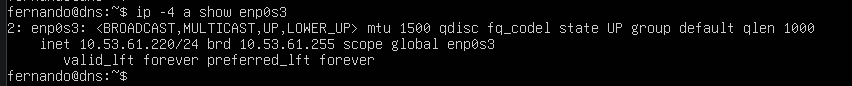

#### B. Configuración de la Zona Directa
Se editó el archivo de zona para el dominio del grupo, vinculando los nombres de host con las direcciones IP físicas de ambos integrantes.

**Ejemplo de configuración de registros:**
* **Registro A (dns):** Apunta a la IP del Integrante 1.
* **Registro A (www):** Apunta a la IP del Integrante 2 (Servidor Web).
* **Registro CNAME (web):** Alias para redireccionar el tráfico de `web.[dominio]` hacia `www`.

> ![Captura del archivo de zona directa db.[dominio] con los registros A y CNAME configurados](imagenes/Imagen34.png)

#### C. Configuración de la Zona Inversa (PTR)
A diferencia de la práctica individual, se implementó una **Zona Inversa**, la cual permite realizar búsquedas inversas (obtener el nombre de dominio a partir de una dirección IP).

1. **Declaración en `named.conf.local`:** Se añadió el bloque `zone` con el formato `in-addr.arpa`.
2. **Creación del archivo de zona inversa:** Se definieron registros **PTR** vinculando los últimos octetos de las IPs con sus respectivos nombres de dominio.

> 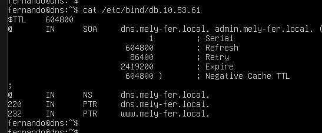

#### D. Verificación y Reinicio del Servicio
Se ejecutaron herramientas de diagnóstico para asegurar que la sintaxis de las zonas (directa e inversa) sea correcta y no presente errores de carga.

* **Comandos de validación:**
  * `sudo named-checkconf`
  * `sudo named-checkzone [dominio] /etc/bind/db.[dominio]`
  * `sudo named-checkzone [red].in-addr.arpa /etc/bind/db.[red]`

> 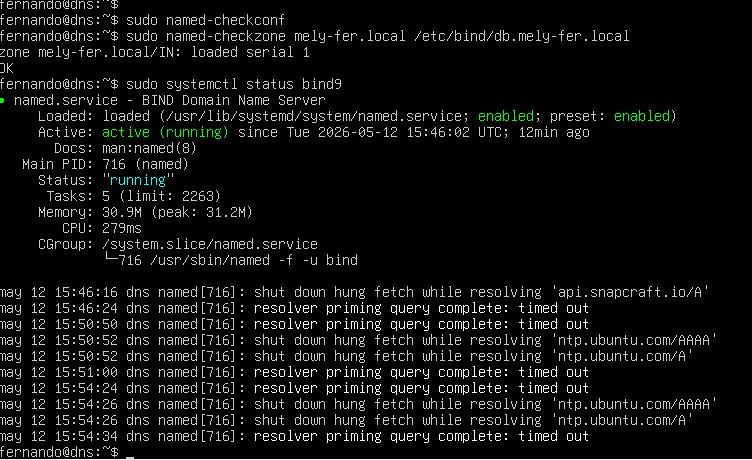

### 8.4. Tareas del Integrante 2 (Servidor Web)

El Integrante 2 fue el responsable de desplegar el servicio de contenido, asegurando que el servidor web sea accesible para el resto del grupo a través de la red física.

#### A. Configuración de Red e Instalación de Nginx
Se configuró la VM Web en **modo Puente** para obtener una identidad propia en la LAN del laboratorio. Tras asegurar la conectividad, se instaló el servidor web Nginx.

* **Comando:** `sudo apt update && sudo apt install nginx -y`

> 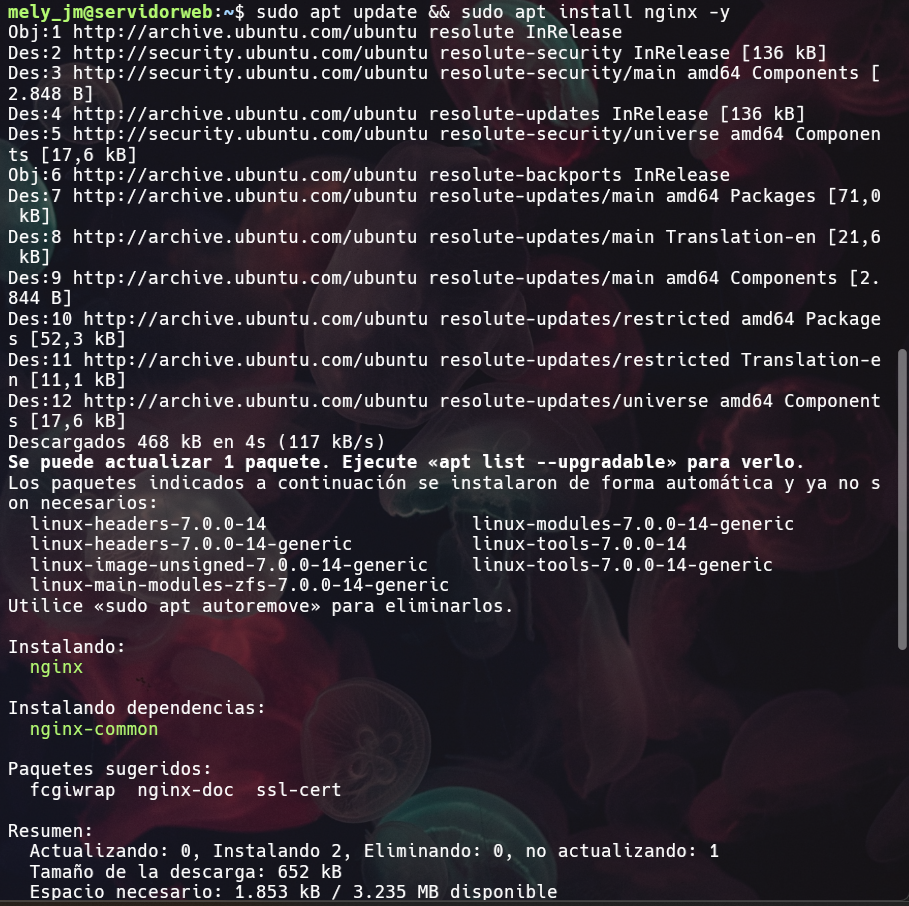

#### B. Creación del Sitio Web Estático (HTML)
Se desarrolló una página de aterrizaje personalizada en HTML. Según los requerimientos, el sitio identifica formalmente al grupo y a sus integrantes.

* **Ruta del archivo:** `/var/www/mely-fer.local/index.html`

> 
> 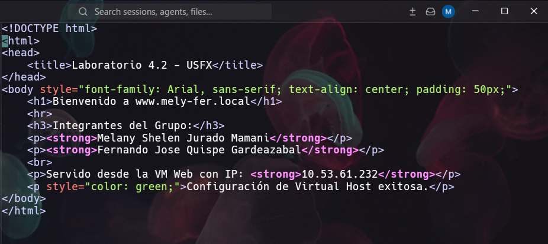

#### C. Configuración del Virtual Host
Para que Nginx procese las peticiones dirigidas al dominio del grupo, se definió un bloque de servidor específico. Este vincula el nombre de dominio con la ruta física de los archivos creados.

> 
> 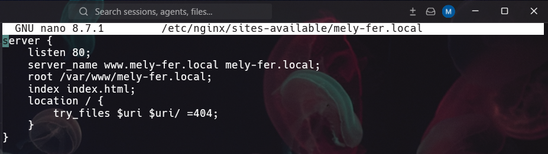

---

### 8.5. Pruebas desde las PC Anfitrionas (Validación de Clientes)

Una vez desplegados los servicios, ambas computadoras físicas del grupo se configuraron como clientes para validar la infraestructura distribuida. El éxito de esta etapa dependió de la correcta visibilidad entre los sistemas anfitriones y las máquinas virtuales en modo Puente.

#### A. Configuración de los Clientes Anfitriones
Se procedió a modificar la configuración de red en los sistemas operativos anfitriones para que utilicen la VM DNS como servidor preferido. Esto permitió que las consultas de dominio no salgan a Internet, sino que sean resueltas internamente por el servidor BIND9 del grupo.

* **Configuración aplicada:** Se estableció la dirección IP de la VM DNS en el campo **"DNS preferido"** de la configuración IPv4 del adaptador de red física.

> 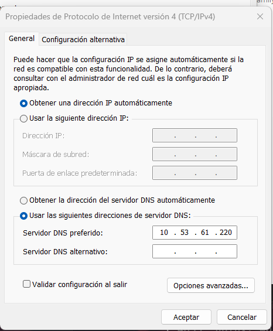

#### B. Apertura de Firewall (Seguridad Perimetral)
Para permitir que las peticiones externas lleguen al servicio DNS, se configuró una regla en el firewall **UFW** de la VM DNS, autorizando el tráfico entrante al puerto 53 desde el segmento de red del aula.

* **Comando:** `sudo ufw allow from 10.53.61.9/24 to any port 53`

> 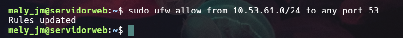

---

#### C. Pruebas de Resolución (Zona Directa e Inversa)
Se realizaron pruebas cruzadas para verificar que ambos tipos de resolución (nombre a IP e IP a nombre) funcionaran correctamente desde los equipos externos a las VMs.

1. **Resolución Directa:** Se utilizó `nslookup` y `dig` para confirmar que el nombre de dominio resuelve a la IP de la VM Web.
2. **Resolución Inversa:** Se validó que, al consultar la IP del servidor web, el DNS devuelva el nombre de dominio correspondiente gracias a los registros **PTR**.

* **Comando:** `nslookup 10.53.61.232`
* **Comando:** `dig -x 10.53.61.232`

> 
> 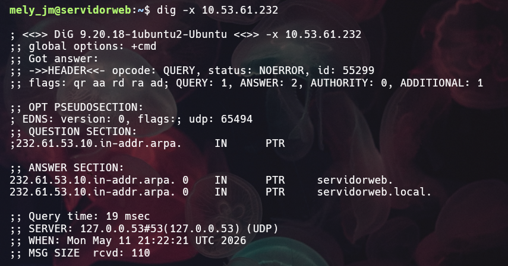
> 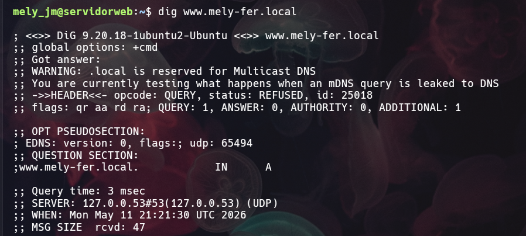

> 

---

#### D. Acceso Web Final por Nombre de Dominio
Como prueba definitiva de integración, se abrió el navegador web en la PC anfitriona y se ingresó el dominio del grupo.

* **Resultado:** El navegador resolvió el nombre a través de la VM del Integrante 1 y cargó exitosamente el contenido HTML alojado en la VM del Integrante 2.

> 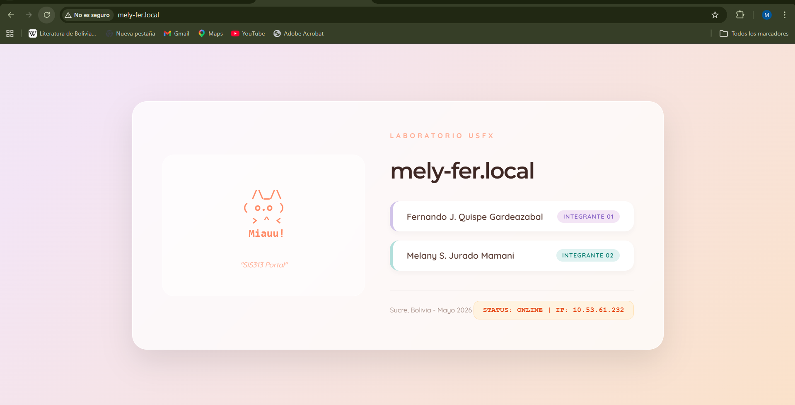

---

## 9. Conclusiones

La realización del Laboratorio 4.2 permitió afianzar de manera práctica los conceptos fundamentales de infraestructura de red y servicios en entornos GNU/Linux. A continuación se detallan las principales conclusiones obtenidas:

* **Integración DNS + Web:** La configuración conjunta de BIND9 y Nginx demostró cómo la resolución de nombres es un componente esencial de cualquier infraestructura de servicios. Sin un servidor DNS funcional, el acceso por nombre de dominio no sería posible, obligando al uso directo de direcciones IP.

* **Rol del Gateway y NAT:** La VM DNS no solo resolvió nombres, sino que también actuó como puerta de enlace para las demás VMs. La configuración del IP Forwarding y las reglas de MASQUERADE en IPTables permitieron que la red interna aislada tuviera acceso controlado a Internet, simulando un escenario real de red corporativa.

* **Diferencia entre Red Interna y Modo Puente:** La práctica grupal evidenció claramente la diferencia entre ambos modos de red en VirtualBox. El modo Puente permitió que las VMs obtuvieran identidad propia dentro de la red física del aula, habilitando la comunicación entre equipos de distintos estudiantes de manera transparente.

* **Zona Inversa (PTR):** La implementación de la zona inversa en la práctica grupal añadió una capa adicional de funcionalidad al servidor DNS, permitiendo la resolución inversa de IPs a nombres de dominio. Este mecanismo es ampliamente utilizado en entornos de producción para auditoría, logs y verificación de identidad de servidores.

* **Importancia de la validación:** El uso de herramientas como `named-checkconf`, `named-checkzone` y `nginx -t` antes de reiniciar los servicios resultó fundamental para detectar errores de sintaxis de forma temprana, evitando caídas del servicio innecesarias.

* **Trabajo colaborativo:** La división de roles en la práctica grupal (Integrante 1: DNS, Integrante 2: Web) reflejó la dinámica real de un equipo de administración de sistemas, donde cada componente debe funcionar de forma independiente pero coordinada para lograr un servicio integral.
